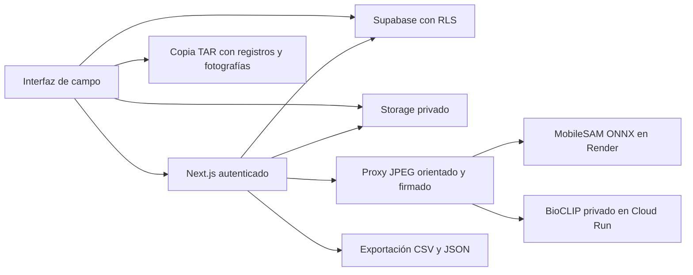

# Arquitectura de LichenDR

La aplicación web está en `apps/web`, con Next.js y React. Los módulos en
`src/modules` contienen la interfaz y los flujos; `src/app/api` contiene las
rutas autenticadas que preparan imágenes y llaman a los motores privados.

La jerarquía es proyecto → sitio → jornada → árbol → muestra de árbol →
fotografía. Una muestra puede tener una serie de cuatro vistas Norte, Este, Sur
y Oeste. Las revisiones guiadas y ecológicas se guardan por fotografía y
orientación, con versiones de concurrencia. Las anotaciones científicas se
mantienen separadas de las sugerencias de IA y de la cobertura exploratoria.

Supabase Auth identifica al propietario. Las lecturas y escrituras conservan las
políticas RLS, incluso en exportaciones y recuperación con sesión de usuario.
Los originales permanecen en el bucket privado `lichen-images`. Next.js valida
propiedad y correspondencia de imagen/muestra/vista antes de preparar el proxy
JPEG o invocar modelos. La firma usa el mismo secreto existente del servicio de
visión; no cambiarlo solo en un entorno que comparte Storage.

MobileSAM propone máscaras por puntos. BioCLIP propone etiquetas con su cabeza
entrenada; el modelo experimental de cinco clases se compara por separado.
En Vercel, BioCLIP utiliza la federación de identidad de Google existente; en
esta Mac, un adaptador del servidor obtiene identidad temporal del SDK autorizado.
Los tokens de los workers y de Google no se incluyen en el navegador.

La segmentación y la clasificación tienen capacidades independientes. Una ruta
solo devuelve su estado de configuración a usuarios autenticados; no revela
secretos ni certifica la disponibilidad del worker. Si un motor falta o falla,
la interfaz conserva las fotos y las decisiones humanas y permite revisión
manual. El modo guiado calcula la cobertura de los colores aceptados por el
usuario; no necesita MobileSAM para esa selección. El editor de regiones ofrece
MobileSAM como ayuda adicional.

Los resultados leen revisiones guardadas; abrir un resumen no ejecuta inferencia
ni modifica anotaciones. Las vistas pendientes conservan ese estado y una
cobertura ausente no se muestra como cero. Una cobertura por foto no es un índice
de calidad del aire ni una identificación de especie.

Ver [AI_SETUP.md](AI_SETUP.md), [DATABASE_SETUP.md](DATABASE_SETUP.md),
[BACKUPS.md](BACKUPS.md) y [DEPLOYMENT.md](DEPLOYMENT.md) para operación y límites.
